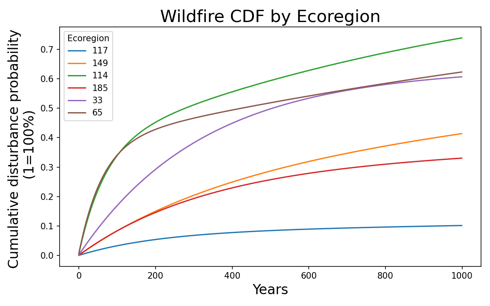
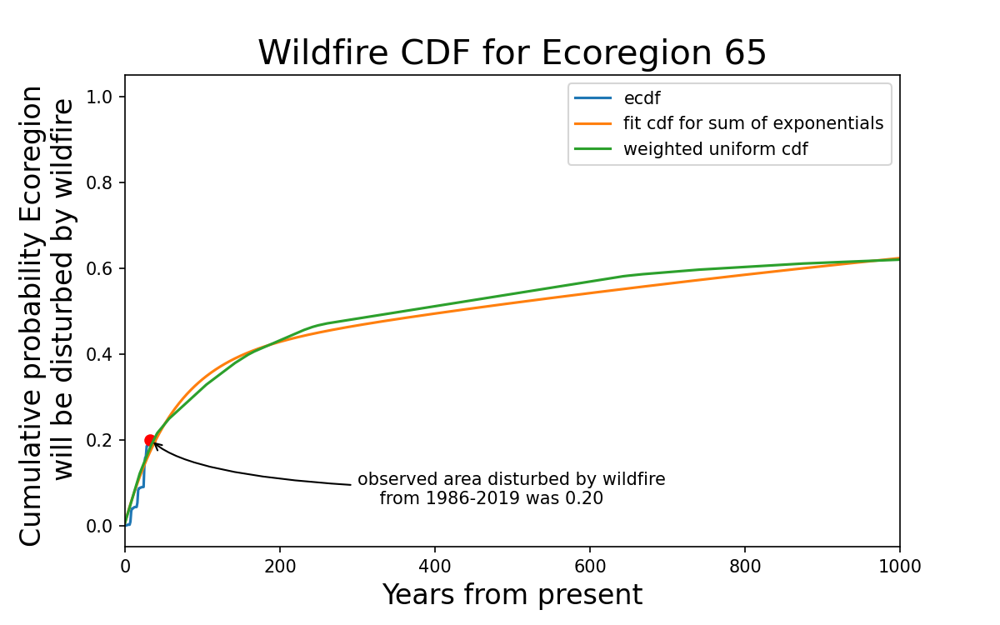

# Canadian wildfire statistics

Wildfire is the dominant stand replacing disturbance in many forest ecosystems. This repository develops wildfire probability estimates by ecoregion using 33 years of historical wildfire statistics from 1986-2019.

Wildfire probability estimates show the likelihood of experiencing a wildfire on a given land area in years from the present and the cumulative probability that a land area will be disturbed by wildfire in the future.

## Approach
Wildfire statistics are available as polygons describing area of land disturbed by wildfire for each wildfire event. Annual land area disturbed by wildfire is computer and summed to generate a weighted uniform probability density function. The uniform probability density function is then fit to a sum of exponentials.

We can check for consistency between the fit cumulative distribution and the actual empirical cumulative distribution. For example, the cumulative area disturbed by wildfire in Ecoregion 65 was 20% over 33 years (1986-2019) while the fit cdf estimates a cumulative disturbance of 17% over 33 years.

## Limitations
Wildfire is caused by fuel load, climate (moisture, temperature) and ignition sources (lightning, human sources). Temporal wildfire PDFs generated from historical statistics are biased estimates of the liklihood of wildfire for any particular land area when these PDFs are developed without controlling for these other variables that are causal determinants of wildfire. Developing wildfire PDFs by ecoregion helps to control for (recent historical) climate. Within each ecozone, estimated wildfire PDFs may overestimate wildfire frequency for forests with recent disturbances (wildfire, harvesting) that have a reduced fuel load, and underestimate wildfire frequency for forest stands that have higher fuel loads like increased deadwood from mountain pine beetle.

Using geometries that are too narrowly defined may lead to biased estimates of wildfire risk if historical wildfire statistics in these small areas are not representative of actual wildfire risk.  Similarly, defining geometries too broadly can lead to locally biased estimates of wildfire risk by overestimating wildfire risk in some areas and understimating wildfire risk in other.

## Future work
For applying the wildfire PDFs to estimate loss of biomass from forests, the approach would benefit from normalizing to total forested area within a polygon rather than total land area as currently implemented. The results could also be improved by accounting for the BURNCLASS which characterizes whether the severity of the burn (partial to complete), but is currently only reported for Alberta.

## Installation
1. install python using anaconda
2. fork the repository
3. open the Anaconda prompt and run `conda env create -f environment.yml`
4. run `python scr\extract_data.py` to download the raw data
